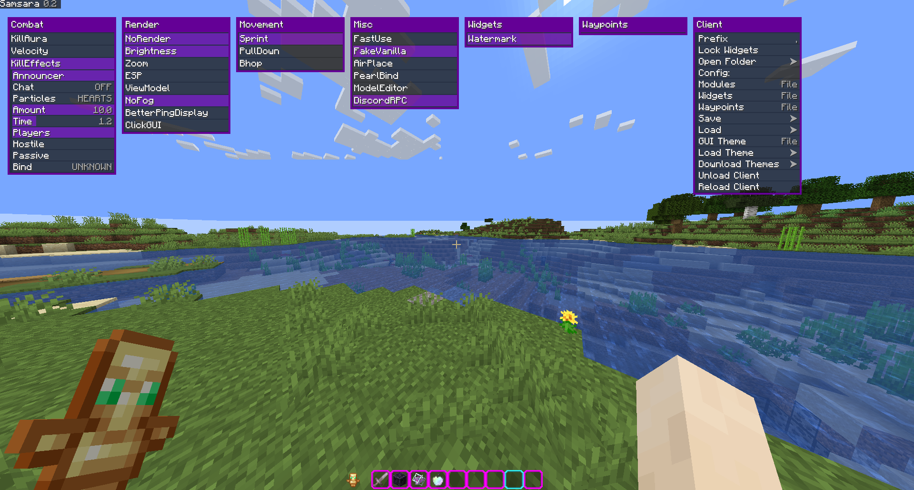
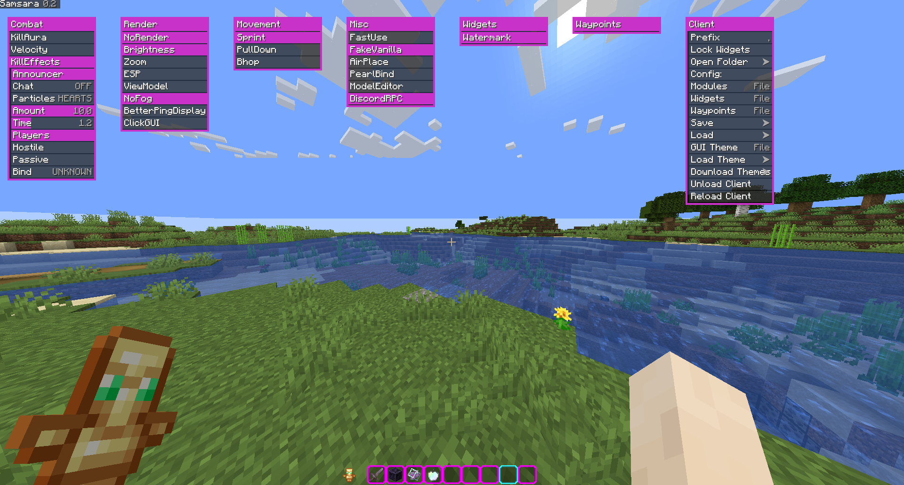

Open-source utility mod for Fabric 1.18.1.

It has (more like will have) features for anarchy servers as well as legit features for non-anarchy use

<b>Screenshots</b>

<h6>Default Theme</h6>

<h6>Blackout Theme</h6>

# Usage
- Download the latest [release](https://github.com/chell-dev/Samsara/releases) or [dev build](https://github.com/chell-dev/Samsara/actions) and put it in your mods folder
- Fabric API is **not** required

The default ClickGUI bind is `\ ` (backslash)

Read the [Wiki](https://github.com/chell-dev/Samsara/wiki) for more info

# Building
`git clone https://github.com/chell-dev/Samsara.git` or download the repository

After building, the output `.jar` will be in `build/libs/`

## IntelliJ (recommended), Eclipse or VSCode

1. Import the project - see https://fabricmc.net/wiki/tutorial:setup, refer to the section for your IDE
2. Run the `build` gradle task

## Windows
1. Open `cmd` in the project folder
2. Run `./gradlew.bat build`

## Linux and Mac
1. `cd` to the project folder
2. Run `./gradlew build`

# Thank you

[Fabric](https://fabricmc.net/) for their mod loader

[LuaJ](https://github.com/luaj/luaj) for their lua interpreter

[Nep Nep](https://github.com/NepNep21) for [DiscordRPC4j16](https://github.com/NepNep21/DiscordRPC4j16)
